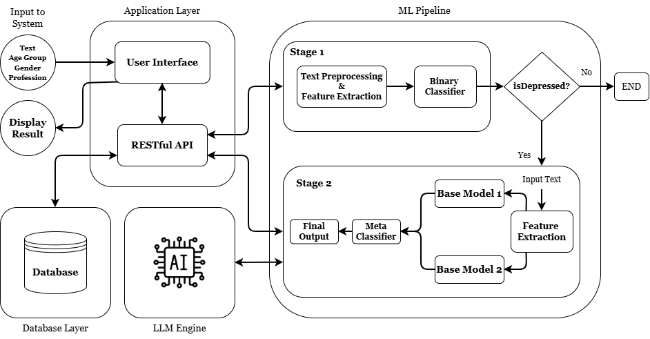

# Project Title

SocialSense: Two-Stage text-based Depression Detection Framework

## Overview

This project implements a Two-Stage Deep Learning based Mental Health Detection System that analyzes textual input to detect depression and classify different psychological disorders.
The system combines Natural Language Processing, Deep Learning, Ensemble Learning, and LLM API integration to simulate a real-world mental health monitoring application.
The model first detects whether a text shows signs of depression, and if detected, it further classifies the mental health condition into multiple disorder categories and generates supportive recommendations.

## How SocialSense Works?

The system follows a two-stage classification pipeline.

**Stage 1:** Binary Depression Detection
Determines whether text is depressive or non-depressive
Uses:
BERT embeddings
Age & Gender features
LSTM / BiLSTM / RNN models
Best performing model used for final prediction

**Stage 2:** Multi-Class Mental Health Classification

Activated only if depression is detected.
The text is classified into one of the five categories:
Suicidal, Anxiety, Bipolar, Stress, Personality Disorder.

Two different feature groups are used:

*Semantic–Psychological Features:*
Sentiment polarity, Subjectivity, VADER score, Absolutist words, Hedonic score

*Linguistic–Stylistic Features:* Readability score, Pronoun ratio,Punctuation density, Lexical diversity, POS ratio

Two base models are trained separately and combined using stacking.

**Ensemble Meta Model:** 
The outputs of both base models are combined using Stacked Ensemble Learning.

Base Model 1 → Semantic–Psychological Features

Base Model 2 → Linguistic–Stylistic Features

Meta Model → XGBoost

*Additional reliability features:*

Margin (confidence)

Entropy (uncertainty)

This improves overall accuracy and robustness.

**LLM Recommendation Module:**
After classification, the system calls an LLM API to generate Supportive suggestions, Coping strategies, Mental health guidance based on output of ML Pipeline and input submitted by user.

This makes the system closer to a real-world AI mental health assistant.

## Features

- Two-stage ML pipeline
- Binary + Multi-class classification
- BERT embeddings
- GloVe embeddings
- Deep learning models (LSTM, GRU, BiLSTM, BiGRU)
- Ensemble stacking
- Psychological feature extraction
- Linguistic feature extraction
- Dataset balancing & augmentation
- API based backend
- LLM recommendation generation
- Confidence score output
- Dashboard ready results

## Tech Stack

**Languages Used:** JavaScript, Python

**Client:** React, Tailwind CSS, Material UI

**Server:** Node, FastAPI

**Database:** MongoDB

**Machine Learning:** Python, TensorFlow / Keras, Scikit-learn, XGBoost, NLTK, SpaCy, Transformers (BERT), GloVe

## System Architecture

## Screenshots

